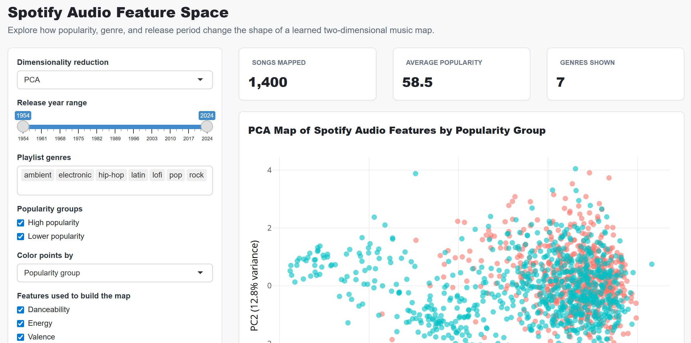

# Spotify Audio Feature Space (PCA Visualization)

## App Preview


This project explores whether high- and low-popularity Spotify songs occupy different regions in audio-feature space.

An interactive Shiny app is used to visualize a two-dimensional embedding of songs based on their audio characteristics.

## 🔗 Live App
https://zijian-zou.shinyapps.io/spotify-pca-map/

## 🎯 Key Question
Can audio features explain differences in song popularity?

## 📊 Features
- PCA-based dimensionality reduction (PC1 = 37.6%, PC2 = 12.8%)
- Interactive filtering by genre, release year, and audio features
- Comparison between high- and low-popularity songs
- Feature profile visualization for interpretability
- PCA loadings to explain feature contributions

## 🧠 Key Insight
The visualization shows partial separation between popularity groups, but also substantial overlap. This suggests that audio features influence popularity but cannot fully explain it.

## 📁 Data
Kaggle Spotify Music Dataset (provided for coursework)

- `high_popularity_spotify_data.csv`
- `low_popularity_spotify_data.csv`

## 🛠️ Tech Stack
- R
- Shiny
- ggplot2
- plotly
- dplyr

## ▶️ Run Locally
```r
install.packages(c("shiny", "plotly", "dplyr", "readr", "ggplot2", "tidyr"))
shiny::runApp()
